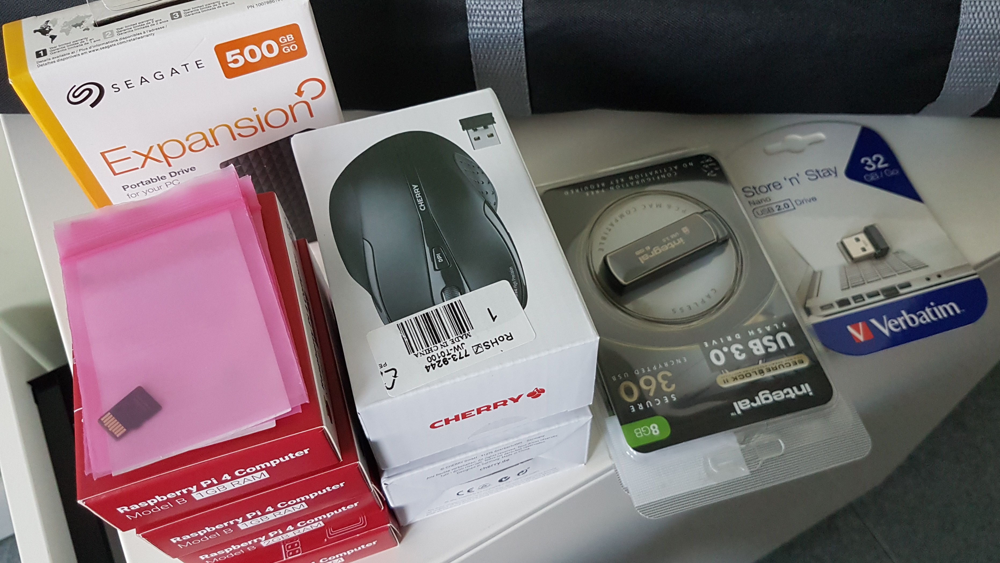
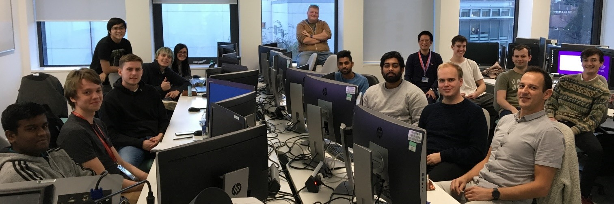
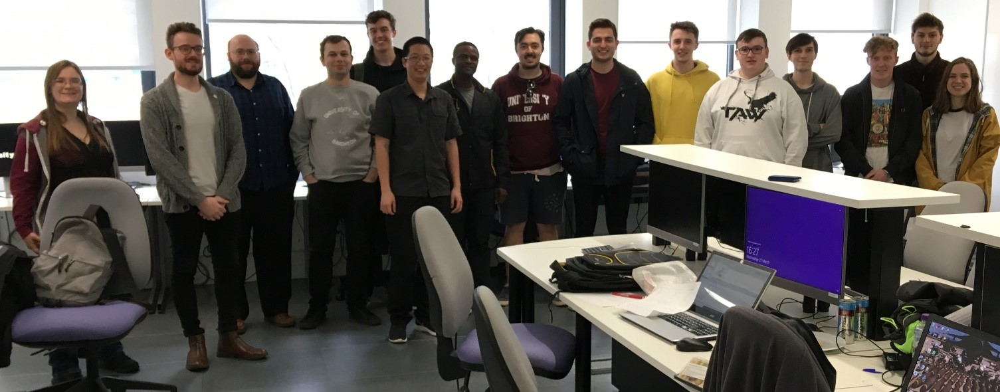
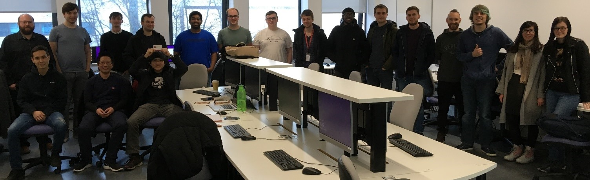
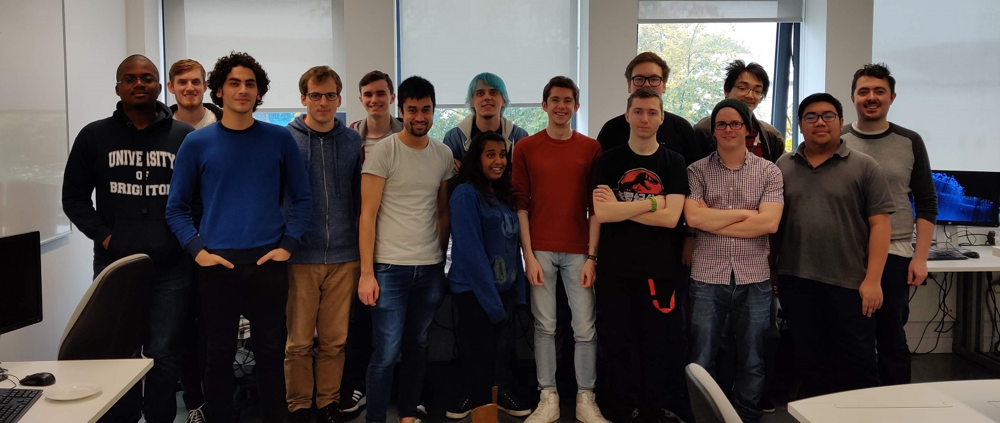
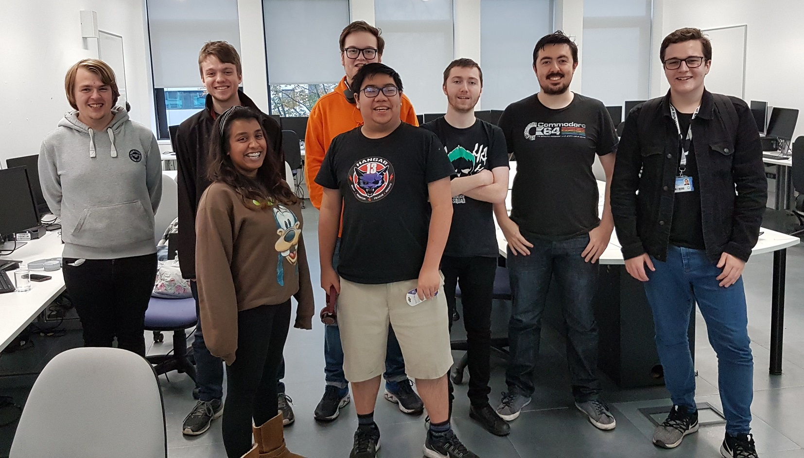
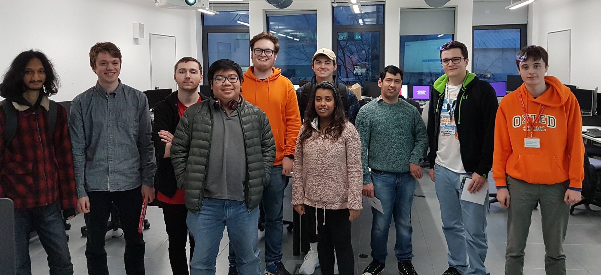
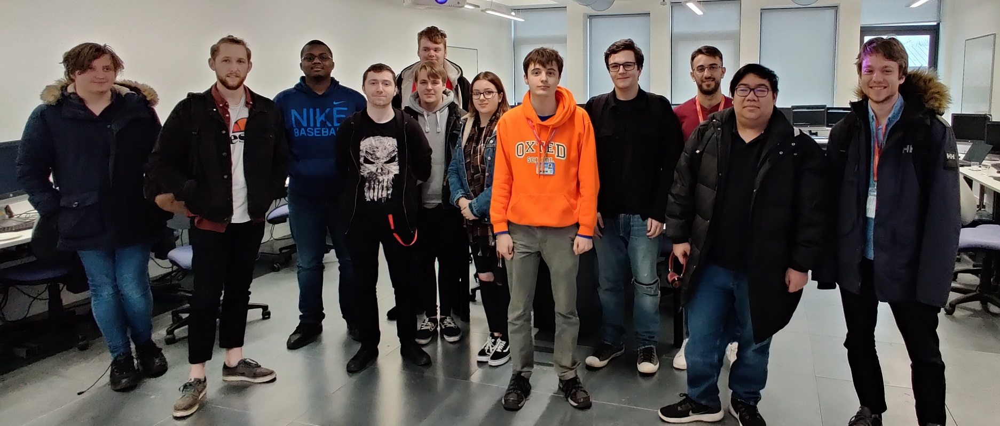

---

### Gamification + Work-based Learning (GWBL)

- Project Overview
- Implementation Details
- Report on 2018-20 achievements

---

#### CLT Scholarship project

- WBL: employability through authentic practical experience.
- Gamification: game principles in non-game contexts.
- Codefest: implementation of GWBL 2018-20.

---

#### Project Aim

Codefest is a monthly software development event that brings together:

- students
- latest technologies in Computer Science
- industry experts

---

#### Implementation

- Teams
- Challenges
- Prizes

---

#### Teams

* Students from all courses are welcome.
* Industry experts are sometimes present to mentor students.

---

#### Challenges

Each challenge has two steps:

1. Given a solution, figure out the question.
2. Implement the solution.

---

#### Challenge Example (Simplified)

The format is: `(input) -> output`

- `(2) -> 4`
- `(3) -> 5`
- `(5) -> 7`

+++

We can derive the question: (x) + 2?


```
int func(int x) {
    return x + 2;
}
```

---

#### Prizes

Sponsors:

CEM School, CSIUS, Springboard, Brandwatch



---

#### Benefits

- Promotes teamwork and peer learning
- Students experience team-based software development workflow
- Students make industry contacts
- Students utilise state-of-the-art software technologies

---

#### Results 2018-20

```
Month    | 2018-19 | 2019-20
October  | 9/15    | 25/50
November | 10/16   | 15/20
December | 16/25   | 12/23
February | 22/29   | 12/15 + 15 college
March    | 15/25   | N/A
May      | 7/9     | N/A
```

---

#### Survey Results

> Codefest events were a great way of improving both technical and teamworking skills whilst having a good time. They were also a good way of meeting people on our course. 

> The Codefest events are amazing and useful.

> Codefest is a nice addition to have

+++

> 'codefests' challenge students and improve their knowledge

> Codefest was an innovative idea but difficult to attend due to running alongside assessments.

> codefest is a learning environment that is fun and also teaches us valuable employability skills.

> extracurricular activities such as the Codefest enhance the learning experience

+++

> Project Management

> Teamwork and how to use GitHub

> Experience in industry, collaboration and development of teamwork and social skills, honing of artistic skills

> Communication, teamwork, and problem solving

---

#### Happy Students 1



+++

#### Happy Students 2



+++

#### Happy Students 3



+++

#### Happy Students 4



+++

#### Happy Students 5



+++

#### Happy Students 6



+++

#### Happy Students 7



+++

#### Marketing Film


---

#### Plan for 2020-21

Codefest moves online!

---

#### Thank you!