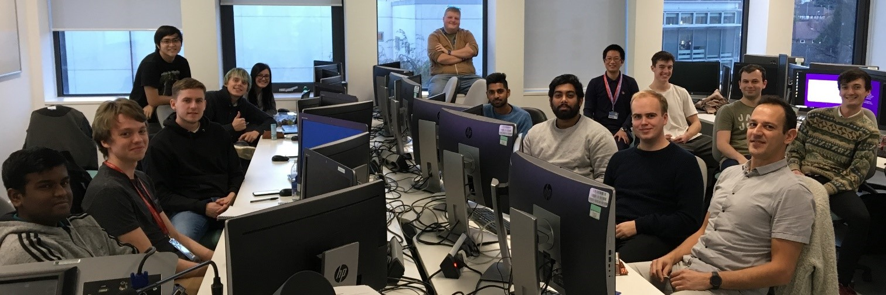
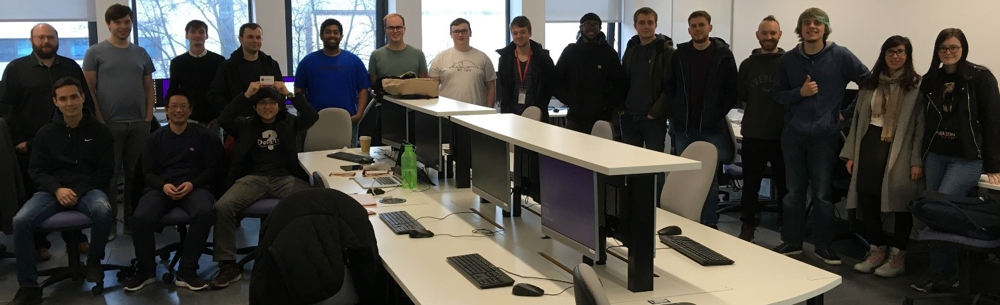

---

### The Codefest Project

> "Give someone a program, you frustrate them for a day; teach them how to program, you frustrate them for a lifetime." - David Leinweber

- Project Overview
- Implementation Details
- Report on 2018-19 achievements

---

#### Gamification + Work-based Learning

Codefest is part of (GWBL), which is a successful CLT Scholarship project, ready to run in 19-20.

---

#### Project Aim

Codefest is a software development event aimed at helping students to progress and use latest
technologies in the field, with the help from industry experts.

---

#### Benefits

- Promotes teamwork and peer learning
- Students experience team-based software development workflow
- Students make industry contacts
- Students utilise state-of-the-art software technologies

---

#### Implementation

- Teams
- Challenges
- Prizes

---

#### Teams

* Students from all courses are welcome.
* Industry experts are sometimes present to mentor students.


---

#### Challenges

Each challenge has two steps:

1. Given a solution, figure out the question.
2. Implement the solution.

---

#### Challenge Example 1

The format is: `(input) -> output`

- `(2) -> 4`
- `(3) -> 5`
- `(5) -> 7`

We can derive the question: (x) + 2?


```
int func(int x) {
    return x + 2;
}
```

---

#### Challenge Example 2

The format is: `(input) -> output`

- `(1, 0) -> 0`
- `(0, 1) -> 90`
- `(-1, 0) -> 180`
- `(0, -1) -> 270`

We can derive the question: the angle of a vector (x, y)?


```
int func(int x, int y) {
    return toAngle(atan2(y, x));
}
```

---

#### Prizes

Typically practical computing devices, such as a Raspberry Pi (image).

Sponsors:

CEM School, CSIUS, Springboard, Brandwatch / Crimson Hexagon

---

#### Results 2018-19

```
Month    | Theme     | Attended / Registered
October  | Maths     | 9/15
November | UI        | 10/16
December | Computing | 16/25
February | Software  | 22/29
March    | Games AI  | 15/25
May      | Games AI  | 7/9
```
---

#### Happy Students 1



+++

#### Happy Students 2


+++

#### Happy Students 3



+++

#### Marketing Film


